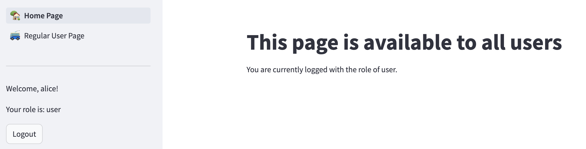
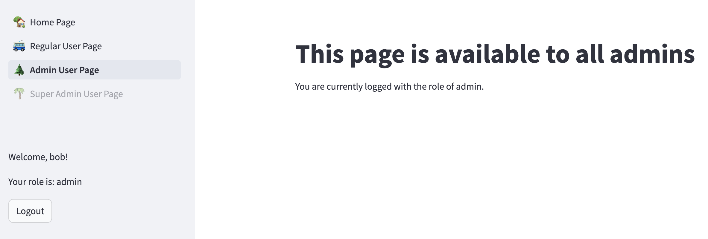
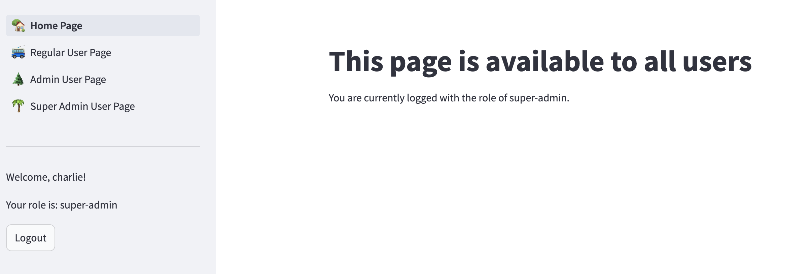

# Streamlit Multiple Pages App with Authentication and Authorization Demo

This repository contains a demo application built with Streamlit. The app features multiple pages, simple authentication, and authorization mechanisms.

## Features

- **Multiple Pages**: The app is structured with multiple pages, allowing users to navigate between different sections or functionalities.
- **Authentication**: Users can log in to the app using a username and password. The authentication system is implemented using a simple in-memory data store.
- **Authorization**: Access to certain pages or features is restricted based on the user's role (e.g., admin or regular user). The authorization system is implemented using role-based access control (RBAC).

## Getting Started

To run the app locally, follow these steps:

1. Clone the repository:

```
git clone https://github.com/your-username/streamlit-multi-page-auth-app.git
```

2. Navigate to the project directory:

```
cd streamlit-multi-page-auth-app
```


3. Run the Streamlit app:

```
python3.11 -m venv .venv311
source .venv311/bin/activate
pip install streamlit
streamlit run app.py
```

The app will be accessible at `http://localhost:8501` in your web browser.

## Usage

Config your user password and roles in secrets.toml file, for example
```
[passwords]
alice = "password123"
bob = "password456"
charlie = "password789"

[roles]
alice = "user"
bob = "admin"
charlie = "super-admin"
```

1. On the login page, enter a valid username and password. 

2. After successful authentication, you will be redirected to the home page.

3. Navigate through the different pages using the sidebar menu.

4. Certain pages or features may be restricted based on your user role. 

### Normal User 
Alice is a normal user, she can only see the normal user pages:


### Admin User
Bob is an admin user, he can see all the pages, but can't access the super-admin page:


### Super Admin User
Charlie is a super admin user, he can see and access all the pages:


## Reference
- https://docs.streamlit.io/develop/tutorials/multipage/st.page_link-nav
- https://docs.streamlit.io/knowledge-base/deploy/authentication-without-sso

## Contributing

Contributions are welcome! If you find any issues or have suggestions for improvements, please open an issue or submit a pull request.

## License

This project is licensed under the [MIT License](LICENSE).